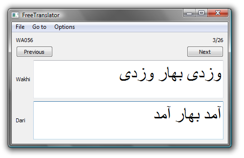

Introduction
------------

FreeTranslator is a low-tech, no-expertise-required way add free translations into FlexText files (for Language Explorer). Language helpers can use this tool to add free translations to FlexText files without having to use Language Explorer. In the window below, the Dari translation is being added to the Wakhi original. (The original text cannot be changed.)



*   The basics:
    *   _File | Open_ Open a file
    *   _File | Save_ Save the file
    *   _File | Exit_ Exit the program
    *   You can double-click on an .flextext file and then tell Windows always to open them with FreeTranslator.
*   Basic Editing
    *   _Next_ Goes to the next line/phrase
    *   _Previous_ Goes to the previous line/phrase
    *   Edit the text in the box to change the line/phrase value
*   Navigation
    *   _Go to | First_ Go to the first line/phrase
    *   _Go to | Last_ Go to the last line/phrase
    *   _Go to | Go to..._ Enter which line/phrase you want to go to
*   Options
    *   _File | Font..._ Sets the font for the annotation editor.

Configuring the display
-----------------------

As you see in the above example, the screen comes up with the languages pre-configured. This is nice for language helpers, but the project lead will need to configure this. This is done with a file called configuration.xml. This file needs to be in the same folder as the executable file, or if you're double-clicking to open .flextext files, it needs to be in the same place as the .flextext files.

configuration.xml is a text file that you can open in Notepad. Here is an example.

```xml
<?xml version="1.0" encoding="utf-8"?>
 <layout>
     <unchangeable-display label="Wakhi">wbl-Arab-AF</unchangeable-display>
     <translation label="Dari">prd-Arab</translation>
     <translation label="English">en</translation>
 </layout>`
```

The unchangeable-display tag refers to the language at the top of the screen, which cannot be changed. In this example, this is “wbl-Arab-AF”, which is Language Explorer's internal name for Wakhi orthography (see [Finding Language Explorer's internal name for your language and writing system](https://adambaker.org/wakhi/finding-internal-name)). On the same line “Wakhi” is the human-readable name, which shows up in the program.

The translation tags refer to the languages for translations. There are two of them in this example; there can be as many as you want. (In the screenshot, there is only one.) In this example, the first translation language is “prd-Arab”, which is Language Explorer's code for Dari (see [Finding Language Explorer's internal name for your language and writing system](https://adambaker.org/wakhi/finding-internal-name)). On the same line “Dari” is the human-readable name, which shows up in the program. The second translation language is “en”, which is Language Explorer's code for English. On the same line “English” is the human-readable name, which shows up in the program.

Downloads
---------

FreeTranslator is created with the [Qt application framework](https://www.qt.io/), released under the GNU Public License. That means, among other things, that you are free to download it and use it, but not to re-sell it.

Qt is a cross-platform framework, so there is the possibility for using this on Mac OS X, Linux, etc. Right now I only have Windows executables because I only have a Windows machine. Perhaps some do-gooder will build versions for other operating systems and send them to me.

I build in Windows with this, which assumes that Qt is installed and visible in your path:

```
qmake -config release
mingw32-make
```

Of course your system would have something different from “mingw32-make”—probably just “make”—if you are not building from Windows using MinGW.
